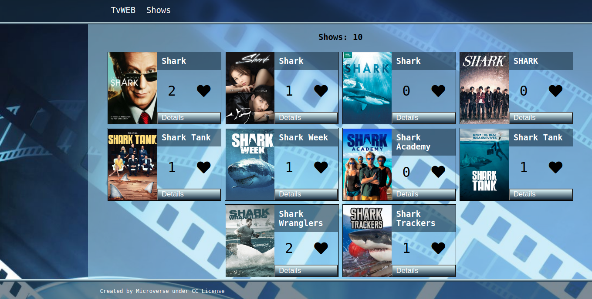

# TvShow Capstone project

> This is a simple display of tv which can be liked and commented

## Built With

- Webpack
- Javascript
- Sass
- [TvMaze API](https://www.tvmaze.com/api)
- [Involvement API](https://www.notion.so/microverse/Involvement-API-869e60b5ad104603aa6db59e08150270)
- Jest
## Live Demo

https://rokovarano.github.io/API-based-webapp/
## Getting Started

**This is an example of how you may give instructions on setting up your project locally.**
**Modify this file to match your project, remove sections that don't apply. For example: delete the testing section if the currect project doesn't require testing.**

To get a local copy up and running follow these simple example steps.

### Prerequisites
- Node.js
### Setup
- clone the Repo: https://github.com/RokoVarano/API-based-webapp.git
### Install
- 
- In the cloned project folder, run 'npm install'
- run 'npm run build'
- run 'npx webpack serve'
### Usage
- To like a movie, click on the heart icon. You cannot click again on it until the score has been loaded
- To see the Comments popup window, click on the 'Details' button
- To create a comment, fill the form at the bottom of the popup and click 'comment'
### Run tests
- in terminal, type 'npm run tests' or 'npx jest'
## We learned:
- To handle promises correctly by chaining them
- To use Promises to fake API calls to be used in tests.
## Authors

👤 **Rodrigo Ibaceta**

- GitHub: [Rodrigo Ibaceta](https://github.com/RokoVarano/)
- Twitter: [@Rodrigo](https://twitter.com/RodrigoIbacet11)
- LinkedIn: [LinkedIn](https://www.linkedin.com/in/rodrigo-ibaceta-a8657611a/)

👤 **Alonso Falconi**
- GitHub: [Alonso Falconi](https://github.com/alonsofl/)
- Twitter: [@AlonsoFalconi](https://twitter.com/AlonsoFalconi)
- LinkedIn: [LinkedIn](https://www.linkedin.com/in/alonsofalconi/) 
## 🤝 Contributing

Contributions, issues, and feature requests are welcome!

Feel free to check the [issues page](../../issues/).

## Show your support

Give a ⭐️ if you like this project!

## Acknowledgments

- Hat tip to anyone whose code was used
## 📝 License

This project is [MIT](./MIT.md) licensed.